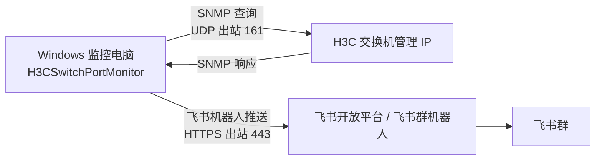
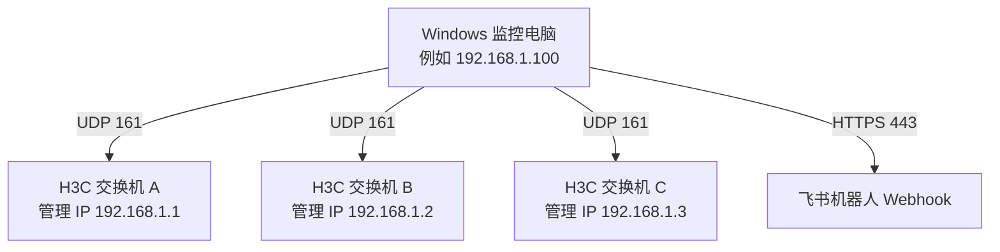

# H3C Switch Port Monitor

Windows 服务程序，用 SNMP 轮询 H3C 交换机端口状态，发现端口 `ifOperStatus` 变化后推送到飞书群机器人。端口备注读取标准 IF-MIB 的 `ifAlias` 字段，对应 H3C 接口下配置的 `description`。

## 网络拓扑

程序只安装在 Windows 监控电脑上。Windows 电脑作为 SNMP Manager，主动访问 H3C 交换机的管理 IP；H3C 交换机作为 SNMP Agent，响应端口状态数据。检测到端口状态变化后，Windows 电脑再通过 HTTPS 调用飞书机器人 Webhook。



多台交换机时，Windows 监控电脑需要能访问每台交换机的管理 IP：



防火墙和 ACL 放行方向：

- Windows 监控电脑 -> H3C 交换机管理 IP：UDP 161
- Windows 监控电脑 -> 飞书 Webhook：TCP 443
- H3C 交换机 SNMP ACL：放行 Windows 监控电脑 IP
- Windows 电脑不需要开放入站 UDP 161，本程序只会自动配置出站 UDP SNMP 规则

## 功能

- 读取端口名：`ifName`，OID `1.3.6.1.2.1.31.1.1.1.1`
- 读取端口描述：`ifDescr`，OID `1.3.6.1.2.1.2.2.1.2`
- 读取管理状态：`ifAdminStatus`，OID `1.3.6.1.2.1.2.2.1.7`
- 读取运行状态：`ifOperStatus`，OID `1.3.6.1.2.1.2.2.1.8`
- 读取端口备注：`ifAlias`，OID `1.3.6.1.2.1.31.1.1.1.18`
- 本地持久化上一轮端口状态，服务重启后仍可发现停机期间发生的状态变化
- 支持飞书机器人签名校验 `Secret`
- 交换机 SNMP 读取失败和恢复时可选推送

## 交换机侧配置

示例仅供参考，实际命令以你的 H3C 设备型号和 Comware 版本为准：

```text
snmp-agent
snmp-agent sys-info version v2c
snmp-agent community read <只读community>
```

接口备注示例：

```text
interface GigabitEthernet1/0/1
 description 上联-防火墙
```

生产环境建议使用独立只读 community，并通过 ACL 限制监控服务器 IP。

## 配置

绿色版推荐双击 `edit-config.cmd` 打开图形配置工具。它可以直接添加、删除、复制交换机配置，并编辑飞书机器人、轮询间隔、SNMP 编码等基础参数。

如果你运行在 Windows Server Core 或没有桌面环境的服务器上，请用 `edit-config-raw.cmd` 或记事本直接编辑发布目录中的 `appsettings.json`：

```json
{
  "Monitor": {
    "PollIntervalSeconds": 10,
    "RetryCount": 2,
    "RetryDelayMs": 1000,
    "SnmpTextEncoding": "GB18030",
    "Firewall": {
      "EnsureSnmpOutboundRule": true,
      "RuleName": "H3CSwitchPortMonitor SNMP Outbound"
    },
    "Feishu": {
      "WebhookUrl": "https://open.feishu.cn/open-apis/bot/v2/hook/替换为你的机器人token",
      "Secret": "如果机器人启用了签名校验则填写"
    },
    "Switches": [
      {
        "Name": "核心交换机-1",
        "Host": "192.168.1.1",
        "Community": "替换为你的只读community",
        "Version": "V2C",
        "TextEncoding": "",
        "IncludeNamePrefixes": [
          "GigabitEthernet",
          "Ten-GigabitEthernet",
          "FortyGigE",
          "HundredGigE",
          "Bridge-Aggregation"
        ]
      }
    ]
  }
}
```

如果只想监控指定端口，可以填写 `IncludeInterfaceIndexes`。如果想排除个别端口，填写 `ExcludeInterfaceIndexes`。

H3C 设备的接口备注常见是 GBK/GB2312/GB18030 编码，所以默认 `SnmpTextEncoding` 使用 `GB18030`。如果你的设备备注是 UTF-8，可以把全局 `SnmpTextEncoding` 改成 `UTF-8`。如果只有某一台交换机编码特殊，可以在该交换机对象里填写 `TextEncoding` 覆盖全局值。

程序启动时会在 Windows 上自动检查并创建一条出站 UDP SNMP 防火墙规则，默认规则名是 `H3CSwitchPortMonitor SNMP Outbound`。这个规则只放行本程序访问交换机的出站 UDP 161，不会打开本机入站 UDP 161。

## 多交换机配置示例

多台交换机就是在 `Monitor:Switches` 数组里继续追加对象。每台交换机可以使用不同的 IP、community、过滤规则和排除端口。

```json
{
  "Monitor": {
    "PollIntervalSeconds": 10,
    "RetryCount": 2,
    "RetryDelayMs": 1000,
    "SnmpTextEncoding": "GB18030",
    "Feishu": {
      "WebhookUrl": "https://open.feishu.cn/open-apis/bot/v2/hook/替换为你的机器人token",
      "Secret": ""
    },
    "Switches": [
      {
        "Name": "核心交换机-1",
        "Host": "192.168.1.1",
        "Port": 161,
        "Community": "h3c_monitor_ro",
        "Version": "V2C",
        "TimeoutMs": 5000,
        "MaxRepetitions": 10,
        "TextEncoding": "",
        "IncludeNamePrefixes": [
          "GigabitEthernet",
          "Ten-GigabitEthernet",
          "FortyGigE",
          "HundredGigE",
          "Bridge-Aggregation"
        ],
        "IncludeInterfaceIndexes": [],
        "ExcludeInterfaceIndexes": []
      },
      {
        "Name": "接入交换机-1",
        "Host": "192.168.1.11",
        "Port": 161,
        "Community": "h3c_monitor_ro",
        "Version": "V2C",
        "TimeoutMs": 5000,
        "MaxRepetitions": 10,
        "TextEncoding": "",
        "IncludeNamePrefixes": [
          "GigabitEthernet",
          "Ten-GigabitEthernet"
        ],
        "IncludeInterfaceIndexes": [],
        "ExcludeInterfaceIndexes": [
          1,
          2
        ]
      },
      {
        "Name": "汇聚交换机-1",
        "Host": "192.168.1.21",
        "Port": 161,
        "Community": "h3c_monitor_ro",
        "Version": "V2C",
        "TimeoutMs": 5000,
        "MaxRepetitions": 10,
        "TextEncoding": "",
        "IncludeNamePrefixes": [],
        "IncludeInterfaceIndexes": [
          10101,
          10102,
          10103
        ],
        "ExcludeInterfaceIndexes": []
      }
    ]
  }
}
```

说明：

- `IncludeNamePrefixes` 不为空时，只监控端口名或端口描述以前缀开头的接口。
- `IncludeInterfaceIndexes` 不为空时，只监控指定 `ifIndex`。
- `ExcludeInterfaceIndexes` 用来排除不需要告警的端口。
- `TextEncoding` 为空时使用全局 `SnmpTextEncoding`；端口备注出现问号或乱码时，优先尝试 `GB18030`、`GBK`、`UTF-8`。
- 同一台 Windows 监控电脑必须能访问这些交换机的管理 IP 和 UDP 161。

## 改进建议评估

- SNMP community 默认值：有必要改。生产环境不应该默认 `public`，现在配置模板已改成需要你填写自己的只读 community，安装器也不再默认填 `public`。
- SNMP 重试机制：有必要改。现在默认失败后重试 2 次，每次间隔 1000ms，用来降低偶发丢包导致的误报。
- 端口备注编码：有必要支持。H3C 中文备注常见不是 UTF-8，当前默认按 `GB18030` 解码，可通过配置切换。
- 日志轮转：当前不是最高优先级。程序主要写 Windows Event Log，只有启动失败才写 `logs\startup-error.log`。长期运行后如果需要完整文件日志，再加 Serilog rolling file 更合适。
- 轮询间隔下限：已经有保护。即使配置成 0，程序也会按 1 秒处理。
- Prometheus / Metrics：暂时不是必需。这个工具当前定位是端口变化告警；如果后续要做趋势、SLA、端口历史曲线，再加 `/metrics` 或本地 LiteDB/SQLite 会更有价值。

## 更新日志

### v1.0.6 (2026-04-20)
- 新增 `DownConfirmCount` 配置项：端口需要连续 N 次 down 才发送告警，默认 3 次，防止网络抖动导致的误报
- 默认 SNMP 超时从 5000ms 提升至 20000ms，提升不稳定网络环境的可靠性
- 端口恢复 up 时立即发送通知（不需防抖）
- 新增 GitHub Actions 自动构建 release workflow

### v1.0.5
- Add visual configuration editor

### v1.0.4
- Decode SNMP text with configurable encoding

### v1.0.3
- Add retry settings and multi-switch docs

### v1.0.2
- Add topology docs and startup diagnostics

### v1.0.1
- Add SNMP firewall auto-configuration

## 发布

在装有 .NET 8 SDK 的机器执行：

```powershell
dotnet restore
dotnet publish -c Release -r win-x64 --self-contained true -p:PublishSingleFile=true -o .\publish
```

## 生成一键安装器

Windows 上执行：

```powershell
.\scripts\build-installer.ps1
```

macOS 或 Linux 上交叉构建 Windows 安装器：

```bash
./scripts/build-installer.sh
```

输出文件：

```text
artifacts\installer\H3CSwitchPortMonitorInstaller.exe
```

把这个 exe 复制到 Windows 服务器上，右键选择“以管理员身份运行”。安装器会自动：

- 释放服务程序到 `C:\H3CSwitchPortMonitor`
- 引导填写飞书机器人地址、SNMP community、交换机 IP 和轮询间隔
- 写入 `appsettings.json`
- 注册并启动 `H3CSwitchPortMonitor` Windows 服务

卸载：

```powershell
.\H3CSwitchPortMonitorInstaller.exe --uninstall
```

卸载并删除安装目录：

```powershell
.\H3CSwitchPortMonitorInstaller.exe --uninstall --remove-files
```

## 生成绿色版 zip

Windows 上执行：

```powershell
.\scripts\build-portable.ps1
```

macOS 或 Linux 上交叉构建：

```bash
./scripts/build-portable.sh
```

输出文件：

```text
artifacts\portable\H3CSwitchPortMonitor-portable-win-x64.zip
```

把 zip 复制到 Windows 电脑后直接解压。先双击 `edit-config.cmd` 修改配置，再双击 `run-console.cmd` 前台测试运行。需要后台长期运行时，右键 `install-service.cmd` 选择“以管理员身份运行”。

绿色版里的配置相关脚本：

- `edit-config.cmd`：打开图形配置工具，适合添加、删除、复制多台交换机。
- `edit-config-raw.cmd`：用记事本打开原始 `appsettings.json`。
- `restart-service.cmd`：保存配置后重启 Windows 服务。

## 直接闪退排查

不要直接双击 `H3CSwitchPortMonitor.exe` 排查问题，先双击绿色版里的 `run-console.cmd`。这个脚本会在程序退出后暂停窗口。

如果程序启动失败，会把错误写到：

```text
logs\startup-error.log
```

常见原因：

- `appsettings.json` 没有放在 exe 同目录
- 飞书机器人 `WebhookUrl` 还没替换成真实地址
- JSON 格式改坏了
- 交换机 IP、SNMP community 或 SNMP 版本填写错误
- 端口备注是问号或乱码时，检查 `SnmpTextEncoding`，H3C 中文备注通常用 `GB18030`
- 普通用户权限无法创建 Windows 防火墙规则；可以右键 `run-console.cmd` 或 `install-service.cmd` 选择“以管理员身份运行”

## 手动安装为 Windows 服务

以管理员身份打开 PowerShell：

```powershell
.\scripts\install-service.ps1 -ExePath "C:\H3CSwitchPortMonitor\H3CSwitchPortMonitor.exe"
```

卸载：

```powershell
.\scripts\uninstall-service.ps1
```

查看日志：

```powershell
Get-EventLog -LogName Application -Newest 50 | Where-Object Source -like "*H3C*"
```

## 飞书消息内容

端口状态变化时会发送类似内容：

```text
[端口状态变化]
设备：核心交换机-1 (192.168.1.1)
端口：GigabitEthernet1/0/1 (ifIndex 1)
状态：up -> down
管理状态：up
端口备注：上联-防火墙
时间：2026-04-16 16:30:00 +08:00
```
